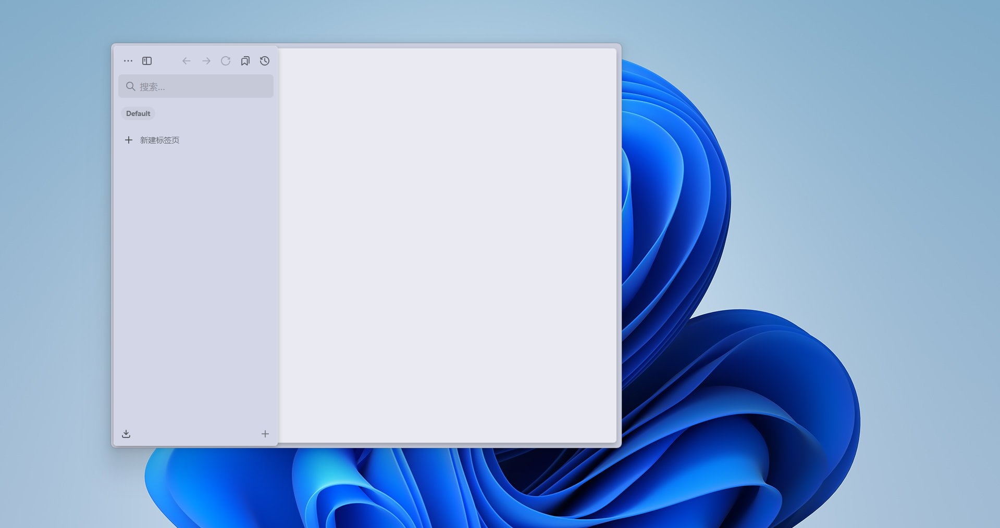

## 有一天……

本来用的Edge，的确和Windows和Microsoft生态联系的很好，Chrome内核也支持很多的生态。但是，巨硬等商业公司一贯的*高占用、高temp、高广告*的**三高精神**还是被它不折不扣的落实了。于是准备切到浏览器三巨头的`firefox`。也久闻**Mozilla基金会**[宣言](https://www.mozilla.org/zh-CN/about/manifesto/)的大名，于是来到了firefox。不过，凡事必然会有但是。edge用惯的分组标签页、垂直标签页等等功能都找不到，在插件市场到处找替代品的时候发现了**Zen**。

### 《极简主义者》

看看介绍是：<u>面向未来的，更好的firefox，基于开源的firefox内核</u>。好吧，拿来看看。

首先是极为华丽的初始化设置和Mozilla账户的无缝衔接。（~~自然，毕竟内核都没换~~）然后就是空无一物的开始界面……

所以它的设计理念就是极简，除了一大堆初学奇怪之后大呼好用的快捷键外，你还要完全重构你的浏览器使用思维，包括但不限于：仅垂直标签页、自动隐藏、没有新建标签页（其实是有的，但是不会常用）、Space思想。但是熟练后还是很不错的。除了……

### 最后

其实浏览器很多奇奇怪怪的功能（比如ai）都没什么用，最重要的是能不能把最**纯粹**的网络呈现给用户。很早以前，人们用着几KB的宽带，访问这世界各地提供的文字、图片，速度很慢，但是却很纯粹；如今网速不断提高，而更快的速度，换来的应该是更精彩便捷的信息世界，而不是，广告商、资本的狂欢。

推荐：[摇一摇，你是怎么敢的？ 【下尺报告】_哔哩哔哩_bilibili](https://www.bilibili.com/video/BV18GoUBZEEo/)
